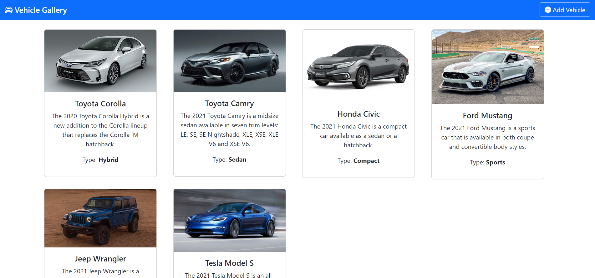

# Vehicle Gallery App



This Angular project is a simple vehicle gallery application that allows users to add, delete, modify, and view vehicles. It utilizes Angular routes to display different sections of the page.

## Table of Contents

- [Features](#features)
- [Installation](#installation)
- [Usage](#usage)
- [Development](#development)
- [Contributing](#contributing)
- [License](#license)

## Features

- **Vehicle Management**: Users can add, delete, modify, and view vehicle details.
- **Angular Routing**: Angular routes are used to navigate between different sections of the application.
- **User-Friendly Interface**: The application provides an intuitive and user-friendly interface for managing vehicles.
- **Responsive Design**: The app is designed to work on both desktop and mobile devices.

## Installation

To run this project locally, follow these steps:

1. Clone the repository to your local machine:

   ```bash
   git clone https://github.com/BlueNacho/Angular-Vehicle-Gallery
   ```

2. Navigate to the project directory:

   ```bash
   cd vehicle-gallery-app
   ```

3. Install the project dependencies using npm:

   ```bash
   npm install
   ```

## Usage

After successfully installing the project, you can start the development server with the following command:

```bash
ng serve
```

This will launch the application locally, and you can access it in your web browser at [http://localhost:4200](http://localhost:4200).

Use the application to perform the following actions:

- **View Vehicles**: Navigate to the "View Vehicles" section to see a list of vehicles in the gallery.
- **Add Vehicle**: Navigate to the "Add Vehicle" section to add a new vehicle to the gallery.
- **Edit Vehicle**: Click on a vehicle in the gallery to edit its details.
- **Delete Vehicle**: In the "View Vehicles" section, you can delete a vehicle by selecting the delete option.

## Development

If you want to contribute to the development of this project, follow these steps:

1. Fork the repository on GitHub.
2. Clone your forked repository to your local machine.
3. Create a new branch for your feature or bug fix.
4. Make your changes and commit them with clear and concise commit messages.
5. Push your changes to your forked repository on GitHub.
6. Create a pull request to the original repository.

Please ensure that your code follows the project's coding guidelines and includes appropriate tests if necessary.

## Contributing

Contributions to this project are welcome and encouraged. If you find a bug or have an idea for an improvement, please open an issue or submit a pull request.

## License

This project is licensed under the [MIT License](LICENSE). You are free to use, modify, and distribute this code as per the terms of the license.